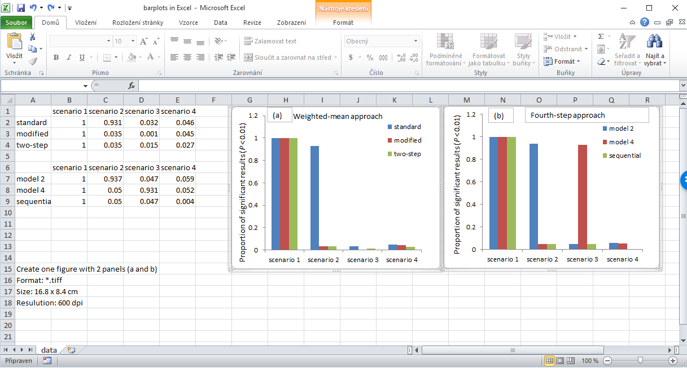

---
output:
  pdf_document:
    latex_engine: xelatex
geometry: a4paper
---

# Redraw barplot from Excel to R

*David Zelený*

## Introduction
I created a nice barplot for my publication in Excel - see the snapshot
of the Excel sheet below, it's really lovely:

{width="500"}

However, when I wanted to submit my paper to *Oecologia* (ecological journal) and read
the author's guidelines for manuscript preparation, I found that they
explicitly state *do not use Excel (.xls) for figures.* 

So, I decided to redraw the figure in R, using the grey-scale colours to save money for colour printing:

{width="500"}

## What to do
Please, create a perfectly reproducible and portable script
(see https://www.davidzeleny.net/wiki/doku.php/recol:reproducible_script), 
which will draw the figure of barplots similar
to the one included in a figure above. The
barplots should fit the following requirements:

  - it should be one figure (file) with two panels labelled as (a) and (b),
  - each panel should include a dashed horizontal line at the y-axis value 0.05,
  - the figure should be saved as `*.jpeg` file with `quality = 100`,
  - the name of the file you create should be `barplots_xxxxxxxxx.jpeg`,
    where `xxxxxxxxx` is your student's ID,
-   size should be exactly 16.8 cm × 8.4 cm,
-   resolution should be 600 dpi.

The figure doesn't have to look exactly like mine, just try to get
close.

The original Excel file is here:
<https://github.com/zdealveindy/recol/blob/main/data/barplots_in_excel.xlsx?raw=true>

Create R file which we can directly open in R, run it, and it will produce a figure of correct size and resolution, stored in JPEG file with the highest quality. This means that you need to load the data from the Excel file (link above).

\newpage
## Hints
  - Import data from online Excel file (check https://www.davidzeleny.net/wiki/doku.php/recol:data_import#import_directly_from_excel_xls_or_xlsx_file). You need to import each table of values separately; for this, the function `read_excel` from the package `readxl` has an argument `range`. The first table can be loaded by setting `range = 'A1:E4'`.
  - Save the figure using `jpeg` function; you will need arguments `filename`, `width`, `height`, `units`, `res`, `quality` and `pointsize`.
  - Don't forget to use function `par` with argument `mfrow` and `mar`.
  - You will need function `barplot` with a number of arguments, including `besides = TRUE` (otherwise the bars will be plotted as stacked bars).
  - Function `abline` will draw dashed horizontal line passing through y = 0.05.
  - The legend can be plotted either by low-level function `legend`, or as a part of `barplot` arguments (this option may need you to study it a bit).
  - Don't forget to `dev.off()`!
  