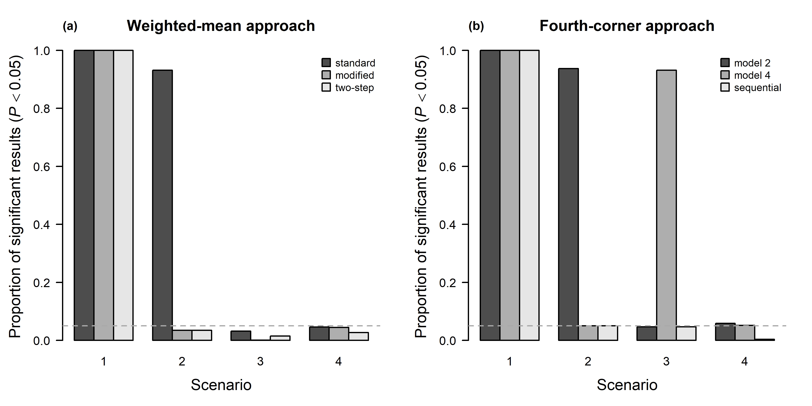

---
output:
  pdf_document:
    latex_engine: xelatex
geometry: a4paper
---
# Redraw barplot from Excel to R - Solution
*David Zelený*


## 1. Importing data from Excel

``` rsplus
library (readxl)
url <- 'https://github.com/zdealveindy/recol/blob/main/data/barplots_in_excel.xlsx?raw=true'
destfile <- tempfile ()
download.file(url, destfile, mode = 'wb')
# argument 'range' allows to specify the range of cells:
w.mean.0 <- read_excel(destfile, sheet = 'data', range = 'A1:E4') 
f.corner.0 <- read_excel (destfile, sheet = 'data', range = 'A6:E9')
# data became tibble (tidyverse), transform to data.frame with rownames:
w.mean <- data.frame (w.mean.0[,-1], row.names = w.mean.0$...1)
f.corner <- data.frame (f.corner.0[,-1], row.names = f.corner.0$...1)
```

## 2. Draw barplots and save them as a single JPEG file

``` rsplus
# Draw the figure:
jpeg (filename = 'barplots_a12345678.jpeg', width = 16.8, height = 8.4, 
    units = 'cm', res = 600, quality = 100, pointsize = 6)
par (mfrow = c(1,2), mar = c(5.1, 5.1, 4.1, 2.1))
barplot (as.matrix (w.mean), beside = T, 
    main = list ('Weighted-mean approach', cex = 1.5),
    las = 1, xlab = list ('Scenario', cex = 1.5), 
    ylab = list (expression (paste ('Proportion of significant results (',
    italic (P) < 0.05, ')')), cex = 1.5), names.arg = 1:4,
    cex.axis = 1.2, cex.names = 1.2)
title (main = '(a)', adj = 0)
abline (h = 0.05, col = 'darkgrey', lty = 'dashed')
legend ('topright', legend = c('standard', 'modified', 'two-step'), pch = 22, 
    pt.bg = grey.colors (3), col = 'black', pt.cex = 2, bty = 'n')

barplot (as.matrix (f.corner), beside = T, 
    main = list ('Fourth-corner approach', cex = 1.5), 
    las = 1, xlab = list ('Scenario', cex = 1.5), 
    ylab = list (expression (paste ('Proportion of significant results (', 
    italic (P) < 0.05, ')')), cex = 1.5), names.arg = 1:4, 
    cex.axis = 1.2, cex.names = 1.2)
title (main = '(b)', adj = 0)
abline (h = 0.05, col = 'darkgrey', lty = 'dashed')
legend ('topright', legend = c('model 2', 'model 4', 'sequential'), pch = 22, 
    pt.bg = grey.colors (3), col = 'black', pt.cex = 2, bty = 'n')
dev.off ()
```

Alternatively, the legend can be drawn directly as an argument within
function `barplot`:

``` rsplus
jpeg (filename = 'barplots_a12345678b.jpeg', width = 16.8, height = 8.4, 
    units = 'cm', res = 600, quality = 100, pointsize = 6)
par (mfrow = c(1,2), mar = c(5.1, 5.1, 4.1, 2.1))
barplot (as.matrix (w.mean), beside = T,
    main = list ('Weighted-mean approach', cex = 1.5),
    las = 1, xlab = list ('Scenario', cex = 1.5), 
    ylab = list (expression (paste ('Proportion of significant results (', 
    italic (P) < 0.05, ')')), cex = 1.5), names.arg = 1:4,
    cex.axis = 1.2, cex.names = 1.2,
    legend.text = c('standard', 'modified', 'two-step'), 
    args.legend = list (bty = 'n', cex = 1.2))
title (main = '(a)', adj = 0)
abline (h = 0.05, col = 'darkgrey', lty = 'dashed')

barplot (as.matrix (f.corner), beside = T, 
    main = list ('Fourth-corner approach', cex = 1.5), 
    las = 1, xlab = list ('Scenario', cex = 1.5),
    ylab = list (expression (paste ('Proportion of significant results (', 
    italic (P) < 0.05, ')')), cex = 1.5), names.arg = 1:4,
    cex.axis = 1.2, cex.names = 1.2,
    legend.text = c('model 2', 'model 4', 'sequential'),
    args.legend = list (bty = 'n', cex = 1.2))
title (main = '(b)', adj = 0)
abline (h = 0.05, col = 'darkgrey', lty = 'dashed')
dev.off ()
```


