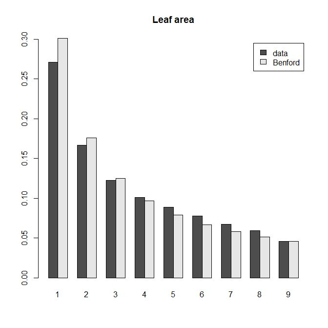

---
output:
  pdf_document:
    latex_engine: xelatex
    pandoc_args: ["--variable=colorlinks:true", "--variable=urlcolor:blue"]
geometry: a4paper
---
# Do the data fit to Benford's law?
*David Zelený*

## Introduction
Benford's law is an interesting mathematical phenomenon: in many
real-world measured data sets, when we take the first digit of each
measured value (i.e. the leftmost digit, regardless of the position of the
decimal point), the most commonly occurring number will be 1, then 2 and
so on, with decreasing frequency, with 9 being the least probable. See
[here](http://www.testingbenfordslaw.com) for a nice website
demonstrating Benford's law on different datasets, or
[Wikipedia](https://en.wikipedia.org/wiki/Benford%27s_law) for the
explanation of why this is happening, or, e.g. [this
paper](https://www.researchgate.net/profile/Andreas_Diekmann2/publication/24083679_Not_the_First_Digit_Using_Benford's_Law_to_Detect_Fraudulent_Scientif_ic_Data/links/553bb08b0cf29b5ee4b87ba9.pdf),
where authors extracted correlation coefficients from many different
scientific studies to check whether they follow Benford's law (and then
asked researchers to 'fake' data, i.e. generate random correlation
coefficients, to show that 'fake' data do not obey Benford's law).

## What to do
-   Prepare the function `follow.benford (data)`, which will draw the
    barplot with frequencies of leading significant digits in the
    argument `data`, where `data` is a vector of numbers (either
    integers or real numbers, including negative values). The same
    barplot will also include a comparison with empirical (expected)
    values derived from Benford's law (see below). From each number
    in `data`, extract the leading (leftmost) digit (not zero, not a
    decimal point, and not a minus sign!).
-   Count the frequency of individual digits (1-9, but not zero), and
    calculate the expected frequency of individual digits if they follow
    Benford's law: P (*d*) = log~10~ ((*d*+1)*/d*), where *d* is the
    digit (e.g. 1), and P(*d*) is the probability that this digit will
    be the leading digit in the dataset (see
    [Wikipedia](https://en.wikipedia.org/wiki/Benford%27s_law)). Simple
    calculation shows that P(1) = 0.301, P(2) = 0.176, P(3) = 0.125, ...
    P(9) = 0.046.
-   Test the function on the following two datasets (see examples of
    codes and results below): population sizes of 233 countries in the
    World (data from
    [Wikipedia](https://en.wikipedia.org/wiki/List_of_countries_by_population_(United_Nations))),
    and measured leaf areas for 3427 leaves from different habitats
    (data from [Blonder et al.
    (2016)](http://www.amjbot.org/content/99/11/1756.short), available
    from the [Dataset website of Brian
    Enquist](https://brianjenquist.wordpress.com/lab-data-and-code/#PLANT%20FUNCTIONAL%20TRAIT%20DATA)).
    Note that below I prepared both datasets for easy download from Gist
    on Github.

``` rsplus
pop <- readr::read_delim ('https://gist.githubusercontent.com/zdealveindy/87f6ac90e989a1dc4c6b41ffd3230cce/raw/43f6261deb22cdf28e70e249c2934c22801483c8/population-of-countries-in-the-world.txt', delim = '\t')
follow.benford (pop$Population)
title (main = 'Population of countries in the World')
```


``` rsplus
data.LA <- readr::read_delim ('https://gist.githubusercontent.com/zdealveindy/9efbebf002d3cccc7528be38309ffffb/raw/528a46e9d1b53821cf92354a5a548ee68bdcfee2/wet-dry-leaf-area.txt', delim = '\t')
follow.benford (data.LA$Wet.area.cm2)
title (main = 'Leaf area')
```



