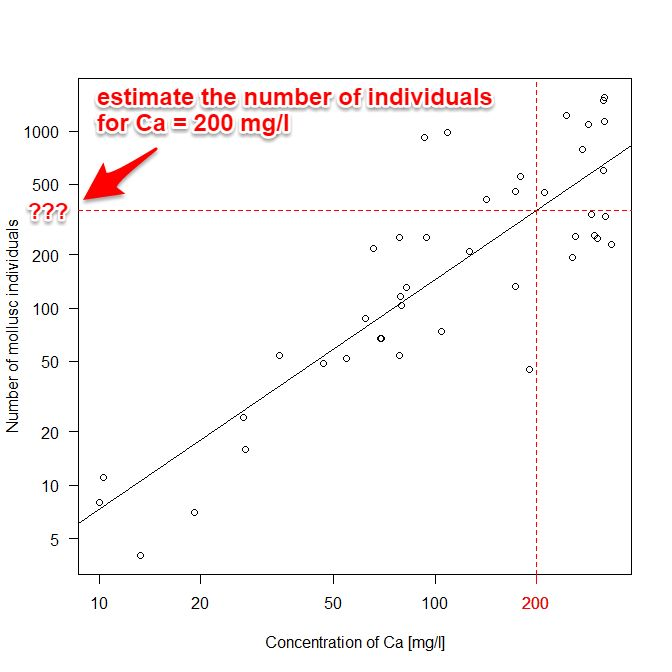

---
output:
  pdf_document:
    latex_engine: xelatex
geometry: a4paper
---
# Estimate the number of mollusc individuals at a given concentration of substrate calcium

*David Zelený & Po-Ju Ke*


## Introduction
Molluscs (snails, bivalves) are invertebrate animals that usually build external calcareous
shell from calcium (Ca) available in the habitat. It seems that the
concentration of Ca in the water (or soil) is a good predictor of mollusc
abundance (and sometimes also mollusc species richness).

Use the dataset about molluscs on spring fens provided below and estimate the number
of mollusc individuals at the concentration of Ca = 200 mg/l in water.

**Dataset:** https://www.davidzeleny.net/wiki/doku.php/recol:data:molluscs

## What to do

1.  Import the `molluscs-fens.txt` and `env-fens.txt` data into R from
    https://www.davidzeleny.net/wiki/doku.php/recol:data:molluscs, using the R code
    in section "Script for direct import of data to R". This will create objects
    `moll` and `env`. The `moll` contains a data frame
    with mollusc species (in columns) and plots (in rows), and
    each cell of the data frame represents *the number of mollusc
    individuals* of given species in a given plot. The `env`
    data frame contains environmental variables measured in each plot, including 
    concentration of Ca in fen water.
2.  First, calculate the total number of mollusc individuals for each
    plot (rows in `moll` data frame).
3.  Calculate the relationship between *the number of mollusc individuals* and the
    concentration of Ca in the spring fen water (variable `Ca` in `env` data frame). 
    Since both variables have right-skewed distribution of values, you need to log-transform
    them first (use log~10~ function on both the number of mollusc
    individuals and Ca concentration).
4.  Calculate linear regression between the log-transformed number of
    mollusc individuals (dependent variable) and the log-transformed concentration of Ca in
    fen water (independent variable).
5.  Predict the estimated number of mollusc individuals for the
    concentration of Ca = 200 mg/l.

Copy the following code at the end of your R code and
replace ?? with calculated values:

```rsplus
    # R2 = ??
    # F-value = ??
    # P = ??
    # NO.IND_Ca200 = ?? (See the note below)
```

**Note:** `NO.IND_Ca200` is the number of individuals predicted by the
linear model for the concentration of Ca equal to 200 mg/l. Report the
real count of individuals, not the logarithmic value which is predicted
by the model. The individual value will be larger than 100 and
lower than 500; if the value is lower, then you perhaps forgot to
recalculate the logarithm into the exponential form.

The prediction can be visualized using the following schema (note that
x- and y-axes are on a log scale, and the **???** is
the value you should calculate). You can try to draw also this figure
if you want (you get no extra credit for that, just a good
feeling that you can accomplish that :)
{width="500"}
\newpage

## Hints

1.  Import data directly from the link on Internet (using provided code in the
    Data description).
2.  Use `rowSums` (remember that we are not interested in *the number of
    species*, but in *the number of individuals*).
3.  Use `log10`.
4.  Use `lm`.
5.  Apply function `predict` on results of `lm`, and modify argument
    `newdata`. Remember that both *number of individuals* and Ca values
    are log-transformed, and you need to first calculate log~10~ (200) to
    log-transform Ca concentration, and then you use this value in `predict`
    function. The predicted value is log~10~ of the number of
    individuals - you need to transform this log-value back into the
    real number of individuals (`10^log.no.ind`).
