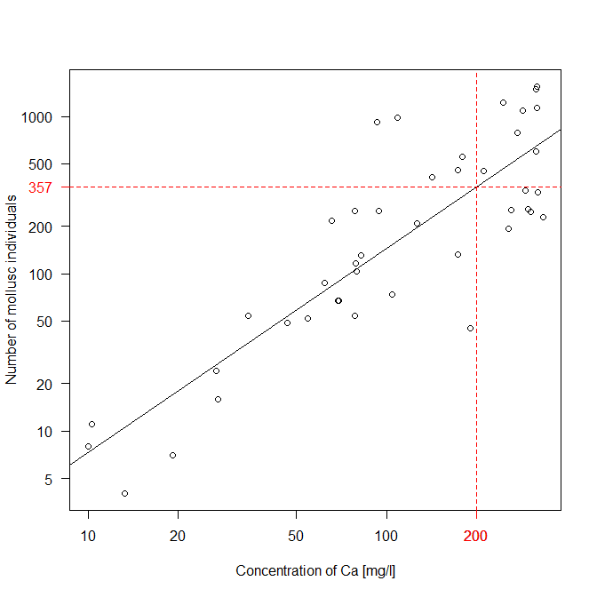

---
output:
  pdf_document:
    latex_engine: xelatex
geometry: a4paper
---

## Estimate the number of mollusc individuals at a given concentration of substrate calcium: Solution

*David Zelený & Po-Ju Ke*

```rsplus
# Read the data:
moll <- read.delim (
 'https://raw.githubusercontent.com/zdealveindy/recol/main/data/molluscs-fens.txt',
 row.names = 1)
env <- read.delim (
 'https://raw.githubusercontent.com/zdealveindy/recol/main/data/env-fens.txt',
 row.names = 1)

# Calculate number of individuals:
no.ind <- rowSums (moll)

# Log-transform number of individuals and Ca concentration:
log.no.ind <- log10 (no.ind)
log.Ca <- log10 (env$Ca)

# Calculate regression
lm.1 <- lm (log.no.ind ~ log.Ca)
summary (lm.1)  # R2 = 0.7291, F = 110.4 on 1 and 41 DF, P = 3.383e-13
# Call:
# lm(formula = log.no.ind ~ log.Ca)
# 
# Residuals:
#      Min       1Q   Median       3Q      Max 
# -0.87343 -0.29577  0.02459  0.24509  0.84175 
# 
# Coefficients:
#             Estimate Std. Error t value Pr(>|t|)    
# (Intercept)  -0.4338     0.2560  -1.694   0.0978 .  
# log.Ca        1.2976     0.1235  10.506 3.38e-13 ***
# ---
# Signif. codes:  0 ‘***’ 0.001 ‘**’ 0.01 ‘*’ 0.05 ‘.’ 0.1 ‘ ’ 1
# 
# Residual standard error: 0.3484 on 41 degrees of freedom
# Multiple R-squared:  0.7291,  Adjusted R-squared:  0.7225 
# F-statistic: 110.4 on 1 and 41 DF,  p-value: 3.383e-13

# Log transform concentration of Ca to predict:
Ca.200 <- log10 (200) 

# predict the log-value of number of species:
log.pred.no.ind <- predict (lm.1, newdata = list (log.Ca = Ca.200))

# backtransform the log number of individuals into real number of individuals:
NO.IND_Ca200 <- 10^log.pred.no.ind


# Results:

# R2 = 0.7291
# F-value = 110.4
# P < 0.001 (or P = 3.383e-13)
# NO.IND_Ca200 = 356.55 (or 357 if rounded)
```

The regression diagram:

```rsplus
plot (no.ind ~ Ca, data = env, log = 'xy', xlab = 'Concentration of Ca [mg/l]',
      ylab = 'Number of mollusc individuals', las = 1)
abline (lm.1)
abline (v = 200, h = NO.IND_Ca200, col = 'red', lty = 'dashed')
axis (1, at = 200, labels = 200, col.axis = 'red', col.ticks = 'red')
axis (2, at = NO.IND_Ca200, labels = round (NO.IND_Ca200), las = 2,
      col.axis = 'red', col.ticks = 'red')
```

{width="500"}
