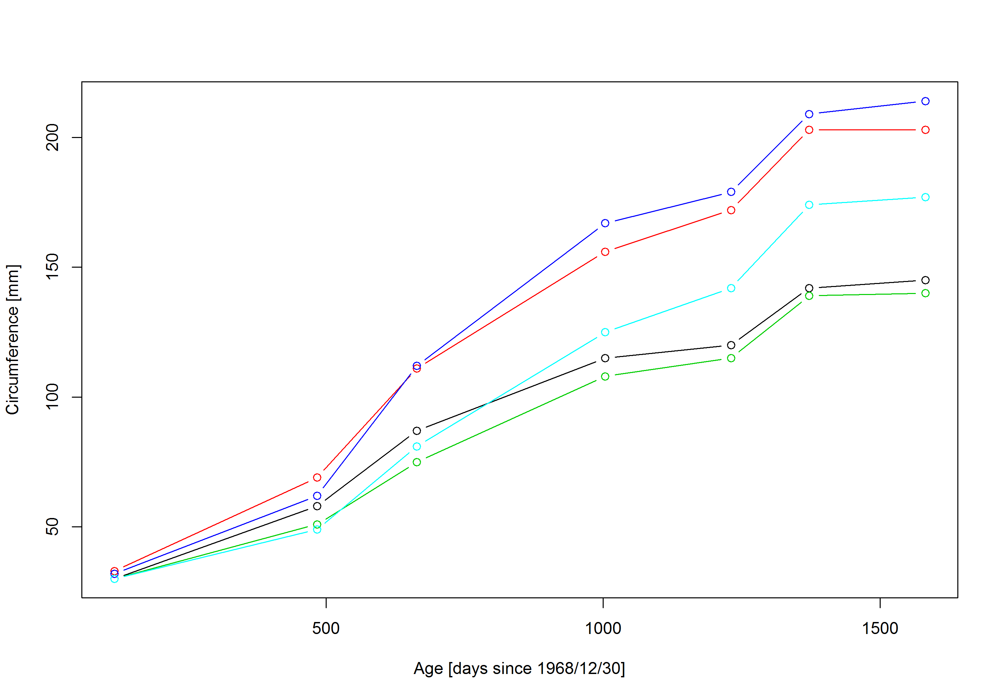

---
output:
  pdf_document:
    latex_engine: xelatex
geometry: a4paper
---

# Fix mistakes in my R-code

*David Zelený*

## Introduction
I wrote an R code, which should produce a `.png` figure describing relationship
between the circumference and age of five orange trees (dataset `Orange`, see
`?Orange` for more details). However, seems that I
made a few mistakes, which makes the R-code not running.

``` rsplus
png (file='orange_trees.png',  heigth  <-7, width<-1O,units ='in",res = 300)
plot(circumference~age,data  =Orange,type  ='n',xlab='Age [days since 1968/12/30]',
ylab  ='Circumference [mm])
for(i in seq (1.  5)){points(circumference~ Age,data=Orange
                             [Orange$Tree==i,], type ='b',col==i){dev.OFF
 
```

## What to do:
  - Can you find and fix these mistakes?
  - The purpose is only to FIX my script, not to completely rewrite it. 
  Fixing usually means replacing the wrong letters or functions with the correct
  ones.


