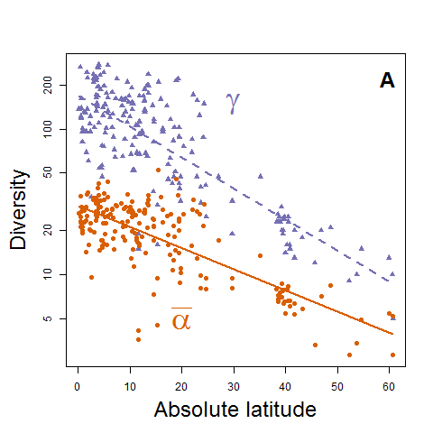
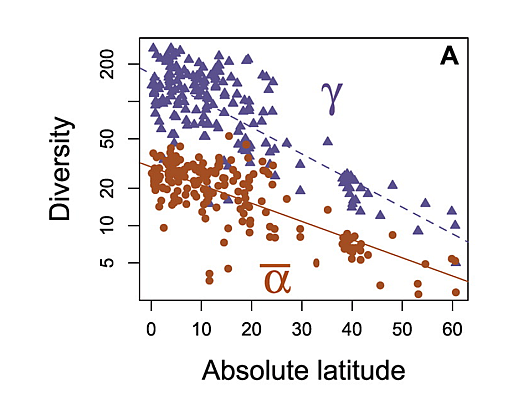

---
output:
  pdf_document:
    latex_engine: xelatex
    pandoc_args: ["--variable=colorlinks:true", "--variable=urlcolor:blue"]
geometry: a4paper
---

# Draw pattern of alpha and gamma diversity along latitude using Gentry's forest plots - Solution
*David Zelený & Po-Ju Ke*

```rsplus
# Alpha and gamma diversity along a latitudinal gradient using Gentry's data

# First, read data from the course website:

# load the object gentry197 (list of 197 elements)
load (url ('https://github.com/zdealveindy/recol/blob/main/data/gentry197.RData?raw=true'))

# load data frame with plot coordinates
gentry.coord <- 
read.delim ('https://raw.githubusercontent.com/zdealveindy/recol/main/data/gentry.coord.txt', 
row.names = 1)

# Calculate mean alpha diversity in individual localities - first sum the values
# in the rows which are higher than 1, and then calculate mean of these rowSums
mean.alpha <- unlist (lapply (gentry197, FUN = function (x) mean (rowSums (x > 0))))

# Calculate the gamma diversity of each locality - a sum of species occurring in 
# each locality (first sum the columns, and then sum the colSums which are higher than 0)
gamma <- unlist (lapply (gentry197, FUN = function (x) sum (colSums (x) > 0)))

# Extract latitude from gentry.coord
latitude <- gentry.coord$Lat

# Choose the colors (Dark2 in www.colorbrewer2.org)
library (RColorBrewer)
cols <- brewer.pal (n = 3, name = 'Dark2')

# Calculate the range of the y-axis values - min and max values of the merged 
# mean.alpha and gamma diversity values
range.ylim <- c(min (c(mean.alpha, gamma)), max (c(mean.alpha, gamma)))

# Plot the figure
pdf ('gentry.pdf')
par (mar = c (5.1, 5.1, 4.1, 2.1))

plot (gamma ~ latitude, log = 'y', pch = 17, col = cols[3], ylim = range.ylim, 
      xlab = list ('Absolute latitude', cex = 2), ylab = list ('Diversity', cex = 2))
points (mean.alpha ~ latitude, pch = 16, col = cols[2])

lm.gamma <- lm (log10 (gamma) ~ latitude)
lat.min.max <- c(min(latitude), max (latitude))
pred.gamma <- predict (lm.gamma, newdata = list (latitude = lat.min.max))
lines (10^pred.gamma ~ lat.min.max, lty = 'dashed', col = cols[3], lwd = 2)

lm.mean.alpha <- lm (log10 (mean.alpha) ~ latitude)
pred.mean.alpha <- predict (lm.mean.alpha, newdata = list (latitude = lat.min.max))
lines (10^pred.mean.alpha ~ lat.min.max, lty = 'solid', col = cols[2], lwd = 2)

# Add the text into the figure (mean alpha and gamma)
text (30, 150, expression (gamma), cex = 3, col = cols[3])
text (20, 5, expression (bar (alpha)), cex = 3, col = cols[2])

# Add the 'A' to the top-right corner
legend ('topright', bty = 'n', legend = 'A', cex = 2, text.font = 2)

dev.off ()

# ggplot2 version (approximate solution)
library (ggplot2)

p <- data.frame (latitude = gentry.coord$Lat, gamma = gamma, mean.alpha = mean.alpha) %>%
  pivot_longer (!latitude, names_to = "diversity", values_to = "value") %>%
  ggplot (aes (x = latitude, y = value, color = diversity), ) +
  geom_point () +
  geom_smooth (method = 'lm') +
  scale_y_continuous (trans = 'log10') +
  theme_bw () +
  theme (legend.position = 'none', panel.grid.major = element_blank (),
         panel.grid.minor = element_blank ()) +
  xlab ('Absolute latitude') +
  ylab ('Diversity') +
  geom_text (aes (x = 25, y = 5, label = "bar (alpha)"), parse = TRUE, size = 10) +
  geom_text (aes (x = 30, y = 100, label = "gamma"), parse = TRUE, size = 10) +
  geom_text (aes (x = 60, y = 250, label = 'A'), parse = TRUE, size = 10)

ggsave (filename = 'gentry.pdf', plot = p)

```

Compare the figure created by this script (upper figure showing the R version)
with the actual figure published in the Kraft et al. (2011) (lower figure):

{width="200"}
{width="200"}

There are some differences between figures - some points in the original
figure do not show in our one, due to a slight difference in the
datasets. When we compiled Gentry's data, we removed all localities with
less than ten transects to enable comparability among localities. At the
same time, the original Kraft et al. paper perhaps also uses localities
with fewer transects. Another reason may be that the original data
(which we used here) are raw - they would need some more processing,
which we haven't done.