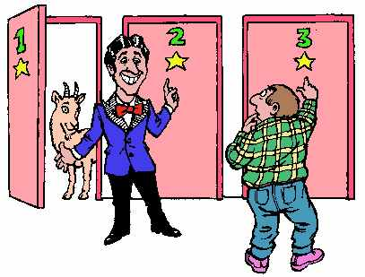
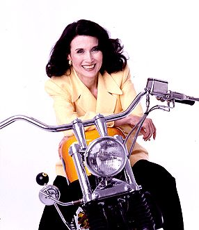

---
output:
  pdf_document:
    latex_engine: xelatex
geometry: a4paper
---
# Monty Hall Problem
*David Zelený & Po-Ju Ke*

## Introduction
Imagine that you join a TV competition, stand in a studio, and should choose one of the three doors. Behind one of doors is a car (e.g.
Maserati, a luxury Italian car), and behind two others are goats (or something similarly attractive, e.g. Shakespeare's drama translated into Serbian). You randomly choose the door
which you want to open - let's say door number 3. The host of the
show, who knows behind which door is Maserati and behind which are
goats, will open the other door (*not* the one you have chosen and
*certainly not* the one hiding Maserati, so let's say he opens door
number 1), to show you that there is a goat. Then he will ask if you
don't want to change your opinion and open door number 2.

The question is: in this situation, is it better to stick to your original
decision (door number 3), or it's better to change the opinion (and open
door number 2)?

## Details
While one would intuitively expect that there is no difference between
sticking to original decision or changing it, surprisingly, there is a difference - if you change your opinion (and the doors), you have higher change to win Maserati. This problem became famous thanks to the newspaper columns of
[Marilyn vos Savant](https://en.wikipedia.org/wiki/Marilyn vos Savant),
which were published weekly in the journal *Parade* under the heading
*Ask Marilyn*. Marilyn vos Savant held the Guinness book record of the
human with highest IQ (228), and in that column, she answered readers'
questions about virtually anything. The question about
*Monty hall problem* occurred in a letter from 9th September 1990.
Marilyn answered that it pays off to change the decision (and to open
other door than you initially selected). After that, thousands of
readers [sent her letters](https://priceonomics.com/the-time-everyone-corrected-the-worlds-smartest/) wondering how could so intelligent woman believe something so stupidly wrong[^1], and that it's obvious that the change doesn't matter and probability is the same in both cases!

You can find theoretical explanation of the problem on the Internet, e.g. on
[Wikipedia](https://en.wikipedia.org/wiki/Monty_Hall_problem), or in
[Youtube](http://www.youtube.com/watch?v=mhlc7peGlGg). The question
could be also solved using computer simulation, where you repeat the
game (say 1000 times) and analyse, if you get higher chance to win
Maserati if you stick or change - and this is exactly what we are going
to do.

## What to do

1.  The goal is to create an R script, which will show what is the
    probability of wining the car in the following two scenarios:
    1.  **always stick to the original door** scenario, i.e. if you
        always stick to the original decision which door to open, and
    2.  **always change the door** scenario, i.e. if you always
        decide to change to the other door offered to you by
        the host. 
2.  Repeat the game 1000 times, and calculate the
        probability that you will win the car in the first scenario
        ("always stick to the original door") and in the second scenario
        ("always change the door").
2.  Create an R script (possibly with annotations), which can be directly
    run (without a need to do anything else) and see the answer, i.e.
    the *probability* of winning the car in the first and the second
    scenario (should be around 0.33 for the first and 0.66 for the
    second scenario).

{width=200px}
Marylin vos Savant

## Hints
You do not really need to simulate the
whole process of the game, i.e. the process of opening different doors
(but you can!). What you may do is simply to generate a matrix with
three columns (each column represents different doors) and 1000 rows
(each row = one game). Then, create a loop (function `for`) which will
in each row randomly locate two goats and one car behind doors (function
`sample`).

The first scenario ("always stick") is simple - just choose randomly one
of the columns of the matrix (e.g. first) and count how many times there
is a car (you may need to use `==` logical operator).

For the second scenario, in which you always change the doors, you can follow this reasoning: if behind the door of your first choice was a car, you always lost (since you changed to another door), while if behind the door of your first choice was not a car, you always win (the car must be behind one of the other doors, and the host opens always the one which has a goat). So, for the second scenario, you can simply choose one column (one door, my first choice) and calculate how many times there is NOT a car - this is the number of games you can win the car.

[^1]: Example of one of them reads as following (cited from
    [Wikipedia](http://en.wikipedia.org/wiki/Monty_Hall_problem#Vos_Savant_and_the_media_furor)):
    "You blew it, and you blew it big! Since you seem to have difficulty
    grasping the basic principle at work here, I'll explain. After the
    host reveals a goat, you now have a one-in-two chance of being
    correct. Whether you change your selection or not, the odds are the
    same. There is enough mathematical illiteracy in this country, and
    we don't need the world's highest IQ propagating more. Shame!" -
    Scott Smith, Ph.D. University of Florida
