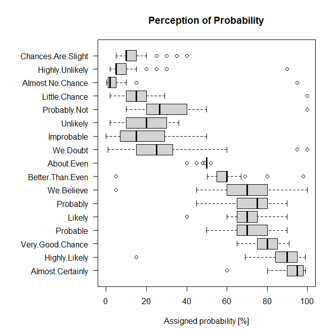

---
output:
  pdf_document:
    latex_engine: xelatex
geometry: a4paper
---

# Perception of probability: draw the boxplot

*David Zelený & Po-Ju Ke*

## Introduction

Sherman Kent, an important CIA officer, once wrote in his report that:

> in an experiment with 23 NATO military officers accustomed to reading
> intelligence reports... they were given a number of sentences such as:
> *It is highly unlikely that*... All the sentences were the same except
> that the verbal expressions of probability changed. The officers were
> asked what percentage probability they would attribute to each
> statement if they read it in an intelligence report... While there was
> broad consensus about the meaning of *better than even*, there was a
> wide disparity in interpretation of other probability expressions.

Inspired by Kent's experiment, a Reddit user *u/zonination* polled
fellow redditors with similar questions to assign probabilities between
0 and 100% for phrases like *chances are slight* or *almost certainly*.
The resulting dataset is here:
<https://github.com/zonination/perceptions/blob/master/probly.csv>

## What to do

Create fully reproducible R code, which will download the dataset
directly from provided GitHub repository and draw the boxplot
visualizing the relationship between the term itself and subjectively
attributes probabilities. The resulting figure should resemble the one
below as closely as possible. The R code can just plot the figure on the
screen, or save it into a file (e.g. as a JPG). Upload the R code into
NTU COOL.

{width="300"}
\newpage
## Hints

-   Check the provided data to see what is the separator between
    individual values, choose the function relevant to this separator,
    and read data directly from online (check here for details:
    <https://www.davidzeleny.net/wiki/doku.php/recol:data_import>).
-   Make sure that the left margin of the figure is wide enough to
    accommodate the labels - function `par` will help you with this, but
    you need to figure out which argument you need to set (call `?par`
    for help). Also, make sure that after drawing the boxplot, you return 
    the `par` setting to the original values.
-   The `boxplot` function usually draws the boxplots vertically, but
    you need to set them horizontally - check which of the function
    arguments can do that. Also, note that labels on the y-axis are
    written perpendicular to the axis, while labels on the x-axis are
    parallel to the axis.
