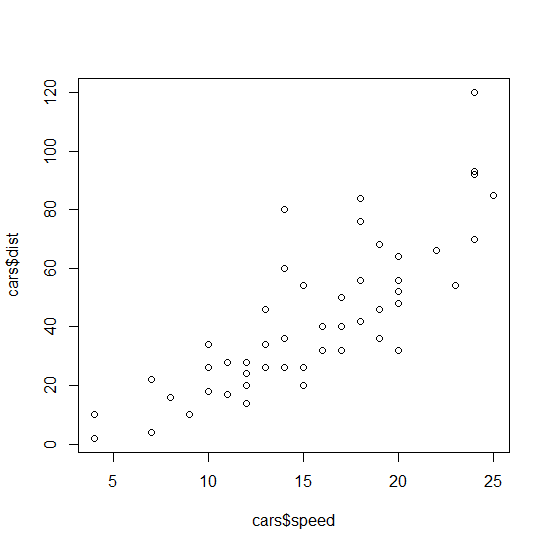

# Plotting figures in R

This is introduction to plotting in R. You will learn how to use
function `plot`, where to find meaning and setting of its graphical
arguments, what is the difference between high-level and low-level
graphical functions, and how to combine them together in order to make a
fine changes in the figure setting.

But first, let's prepare the data to use. We will use the dataset
''cars'', which is R build-in dataset - you don't need to upload it from
anywhere. Simply type ''cars'' in the concole. Let's have a short review
of this dataset:

``` rsplus
class (cars)  # data.frame - the function class checks the type of the object (vector, matrix, data.frame, list)
names (cars)  # "speed" "dist" - names of the variables (columns) in the data frame cars
dim (cars)    # 50 2 - it has 50 rows (samples) and 2 columns (variables)
```

The dataset is an old one (check `?cars` to see the help file with the
description), from 1920, containing information about the breaking
distance (`dist`, in feets) of the car going certain speed (`speed`,
miles per hour).

The data frame can be subsetted in several ways (square brackets, \$
operator), but in the following we will use the fact that individual
variables can be accessed by their names (=names of the columns).

``` rsplus
cars$speed    # returns vector with values of the first column (variable speed)
cars$dist     # returns vector with values of the second column (variable dist)
```

We want to plot the relationship of the breaking distance on the speed
of the car (speed is independent variable and breaking distance is
dependent - the faster the car goes, the longer is going the be the
breaking distance) - the distance will be on the y-axis (vertical) and
speed on the x-axis (horizontal).

``` rsplus
plot (x = cars$speed, y = cars$dist)
```

{query="?nolink"}

More convenient instead of `plot (x, y)` format is to use formula
interface inside the `plot` function, ie `plot (y ~ x, data)` format:

``` rsplus
plot (dist ~ speed, data = cars)
```

{query="?nolink"}

The formula interface is used when there is dependent (y) and
independent (x) variable, e.g. in the regression of y on x (which can be
expresed by regression equation y = a + b\*x, where coefficient a is the
intercept and b is the regression slope). The `~` operator is called
tilda (or tilde) and on the keyboard can be found in the upper left part
(try it, you will often need it). The formula interface has two parts,
separated by comma; first is the dependence of variables (y \~ x), and
second is defining where (in which data.frame) these variables are
stored (unless they are in Global environment).

To understand how this works, try the following:

``` rsplus
plot (dist ~ speed)  # Error in eval(predvars, data, env) : object 'speed' not found
```

... is not working, because variables `dist` and `speed` are not in the
Global environment. But we can allow R to find it by `attach`ing it to
the Global environment using `attach`:

``` rsplus
attach (cars)
plot (dist ~ speed)  # this works - both variables are searchable from Global environment
```

The opposite of `attach` is `detach`:

``` rsplus
detach (cars)
plot (dist ~ speed)  # Error in eval(predvars, data, env) : object 'speed' not found
```

After detaching `cars` from Global environment, I can't call them
directly anymore. But I can use the argument ''data = '' to make sure
that they can be found inside the `cars` data.frame:

``` rsplus
plot (dist ~ speed, data = cars)
```

## Modifying the graphical arguments inside the plot function

Now, let's modify the basic figure in the following way: - add x- and
y-axis labels, - change the symbol into the circle filled by different
colour, - change the colour of the symbols into 'tomato' one (see
`colours ()` for the list of all named colours in R) and the filling
(background) of the symbol into yellow,

1.  change the range of the x-axis to include zero,
2.  add the title of the whole plot on the top.

``` rsplus
plot (dist ~ speed, data = cars,
      xlab = 'Speed [mph]', ylab = 'Distance [ft]',  # 1
      pch = 21,                                      # 2
      col = 'tomato', bg = 'yellow',                 # 3
      xlim = c(0, 25),                               # 4
      main = 'Scatterplot')                          # 5
```

{query="?nolink"}

There is a long list of graphical parameters which can be modified when
you are plotting your figures. You can search fo them in several places:

-  - plotting commands
  by Tom Short
-  (from R
  Graphics by P. Murrell)
- help to the function `plot.default` offers detail description
- help to the function `par` contains even longer list of parameters
  (those which can be used also inside low-level graphical functions,
  see below).

## Combining high-level and low-level graphical functions

Plotting functions in R are of two types: high-level and low-level.
High-level functions do "all the job", ie they open the graphical device
(if it's not already open), prepare the axes so as all plotted data can
display on them, and then plot what is required. Apart to ''plot'',
other high-level functions are e.g. ''boxplot'', ''barplot'', ''hist''
or `pie`. In contrast, low-level functions are only adding into already
existing plot. If you want to add data as points in the scatter plot,
use `points`, or you can connect them by `lines`, you can also add
customized `axis` one by one, draw the `box` around the plot, and add
`titles` (e.g. x- and y-axis labels or the main title) or `legend`.

**Remember: low-level functions must be used after the first high-level
function has been called, otherwise you will get the error message that
the new plot was not plotted yet.** The example above would look like
this when using high-level and low-level graphical functions:

``` rsplus
plot (dist ~ speed, data = cars,                     # a) data to be used,
      xlim = c(0, 25),                               #    define range of the x-axis,
      axes = FALSE, ann = FALSE, type = 'n')         #    make sure nothing will be actually plotted 
points (dist ~ speed, data = cars,                   # b) add data points,
        pch = 21, col = 'tomato', bg = 'yellow')     #    with given symbols and colours
title (xlab = 'Speed [mph]', ylab = 'Distance [ft]', # c) add x- and y-labels,
       main = 'Scatterplot')                         #    add main title to the plot
box ()                                               # d) add box around the plot
axis (1)                                             # e) add axis 1 (bottom horizontal)
axis (2)                                             # f) add axis 2 (left vertical)
 
```

The figure below shows how is the sequence of the plotting (each panel
is labeled by the same letter as the appropriate line of the code above;
the first panel is empty, because it is the result of plotting by the
`plot` function with arguments `axes`, `ann`otations and `type` set to
plot "nothing"):

{query="?nolink"}

The benefit of combining high- and low-level graphical functions is
finer control of what can be changed in the plot. For example, let's
modify the figure above by doing the following:

1.  make a wider boundary of the symbol (the tomato colour will be more
    obvious),
2.  make the labels (x- and y-axis and the title) closer to the main
    plot, and increase the font size of the x- and y-axis labels
3.  modify the box to have only the bottom and left side (looking like a
    letter L),
4.  make the tick-mark labels on the left axis horizontal (not
    vertical), and all ticks pointing inward.

``` rsplus
plot (dist ~ speed, data = cars,
      xlim = c(0, 25),
      axes = FALSE, ann = FALSE, type = 'n')
points (dist ~ speed, data = cars,
        pch = 21, col = 'tomato', bg = 'yellow', 
        lwd = 2)  # lwd = line width, here related to data points     
title (xlab = list ('Speed [mph]', cex = 1.2), ylab = list ('Distance [ft]', cex = 1.2), 
       main = 'Scatterplot',
       line = 2.5)  # line = the distance of the titles from plot margin
box (bty = 'l')     # bty = box type, here 'l' (L shape)
axis (1, at = seq (0, 25), tck = .02)  # at = positions where tickmarks are plotted,
                                       # tck = tickmarks pointing inside
axis (2, las = 2, tck = .02)  # las = orientation of tick-mark labels,
                              # tck = tickmarks pointing inside
```

{query="?nolink"}

Note that even if we asked R to plot each tickmark at the x-axis, the
labels are plotted only for every second one - R makes sure the labels
do not overlap, and should this happen, it will skip some. If you resize
the figure (make it wider), you will see that you get labels at every
tickmark.
